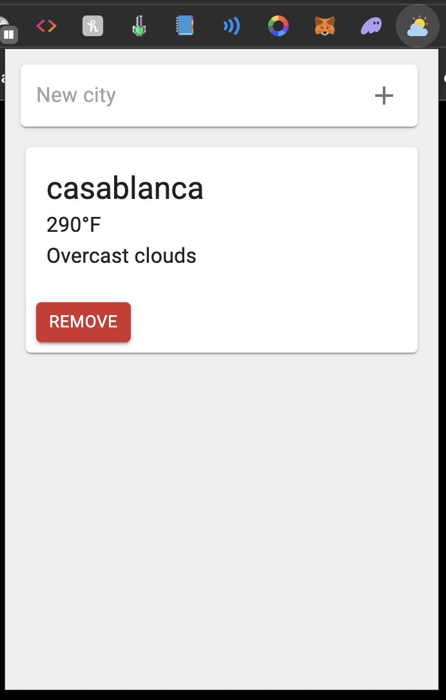

# WeatherLink React Chrome Extension

    

WeatherLink is a Chrome extension developed as part of a learning project, designed to integrate seamlessly with the Open Weather API. It provides real-time weather data for various cities, serving as a practical application of Chrome extension development and API integration skills. This project is ideal for those interested in understanding how to create functional extensions for browsers.

## Getting Started

1. `npm i` to install dependancies
2. `npm start` to start running the fast development mode Webpack build process that bundle files into the `dist` folder
3. `npm i --save-dev <package_name>` to install new packages

## Loading The Chrome Extension

1. Open Chrome and navigate to `chrome://extensions/`
2. Toggle on `Developer mode` in the top right corner
3. Click `Load unpacked`
4. Select the entire `dist` folder

# Production Build

1. `npm run build` to generate a minimized production build in the `dist` folder
2. ZIP the entire `dist` folder (e.g. `dist.zip`)
3. Publish the ZIP file on the Chrome Web Store Developer Dashboard!
